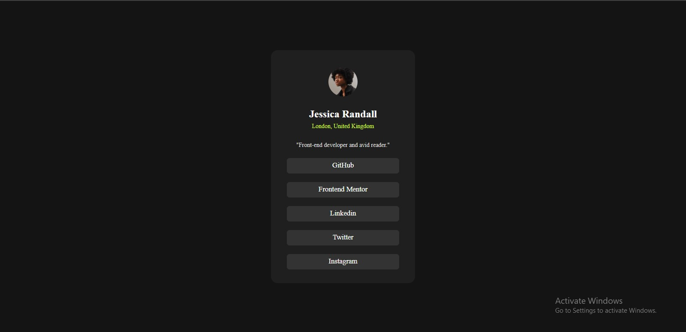

# Frontend Mentor - Social links profile solution

This is a solution to the [Social links profile challenge on Frontend Mentor](https://www.frontendmentor.io/challenges/social-links-profile-UG32l9m6dQ). Frontend Mentor challenges help you improve your coding skills by building realistic projects. 

## Table of contents

- [Overview](#overview)
  - [The challenge](#the-challenge)
  - [Screenshot](#screenshot)
  - [Links](#links)
- [My process](#my-process)
  - [Built with](#built-with)
  - [What I learned](#what-i-learned)
  - [Continued development](#continued-development)
- [Author](#author)
- [Acknowledgments](#acknowledgments)

## Overview

This is social link profile. It has profile photo, place, and job detail. It also include person social media link through which you can check his account.

### The challenge

Users should be able to:

- See hover and focus states for all interactive elements on the page

### Screenshot

Desktop

Mobile

### Links

- Solution URL: [Solution](https://github.com/Nandakishor-M/social-links-profile.git)
- Live Site URL: [Live Site](https://nandakishor-m.github.io/social-links-profile/)

## My process

### Built with

- Semantic HTML5 markup
- CSS custom properties
- Flexbox
- CSS Grid

### What I learned

I learned to more on grid,transition property.

### Continued development

Planning to start with bootstrap.

## Author

- Github - [Nandakishor M](https://github.com/Nandakishor-M)
- Frontend Mentor - [Nandakishor M](https://www.frontendmentor.io/profile/Nandakishor-M)

## Acknowledgments

I thank Frontend Mentor for this project.
